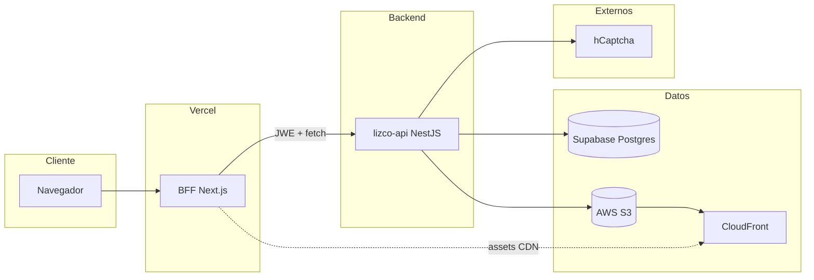
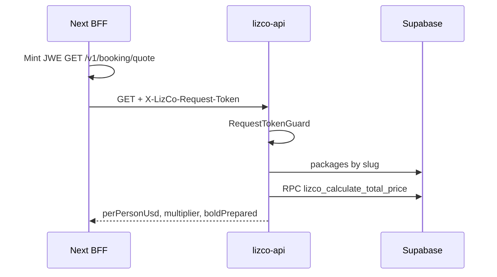
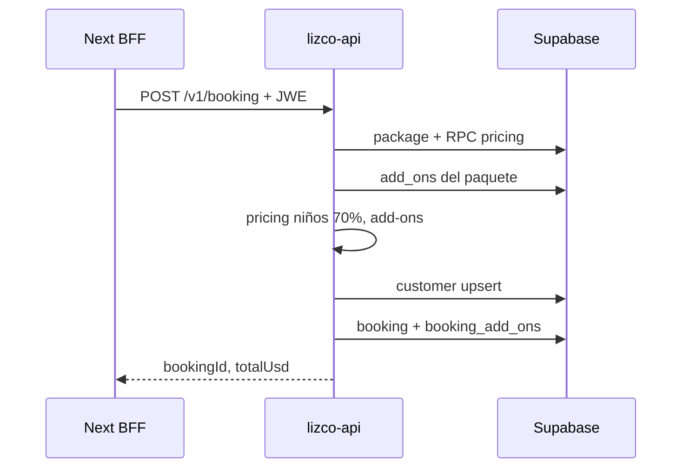
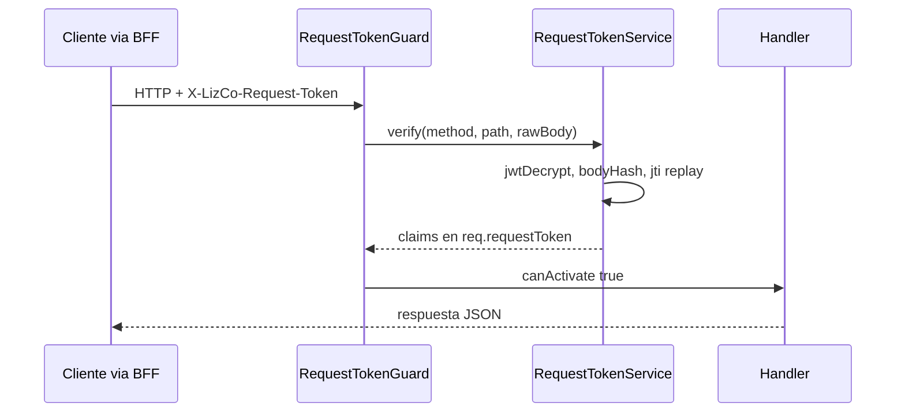

# LizCo API — Análisis de arquitectura

Documento de referencia del backend **LizCo Global Tours** (`lizco-api`). Describe propósito, stack, seguridad, módulos, datos, flujos y operación.

**Última revisión:** 2026-05-19  
**Versión del paquete:** 0.1.0  
**Runtime:** Node.js ≥ 20

---

## 1. Resumen ejecutivo

`lizco-api` es una API REST construida con **NestJS 11** que reemplaza las rutas `app/api/*` del monolito Next.js del sitio LizCo Global Tours. Centraliza:

| Dominio | Responsabilidad |
|---------|-----------------|
| **Catálogo** | Destinos, paquetes, add-ons, blogs |
| **Reservas** | Cotización server-side y creación de bookings |
| **Contacto** | Formulario de contacto y newsletter |
| **Asistente IA** | Snapshot de catálogo para el chat del sitio |
| **Admin** | Identidad de staff vía JWT Supabase |
| **Media** | Listado de assets en S3/CloudFront |

**Supabase** actúa solo como motor **Postgres + Auth** (cliente con `service_role`, schema `enterprise_tours`). El navegador no habla con Supabase directamente.

**Canal cifrado adicional a TLS:** todo request hacia `/v1/*` exige el header `X-LizCo-Request-Token` (JWE ECDH-ES + A256GCM), emitido por el BFF Next.js con la clave pública. Solo `/health` y `/ready` son públicos.

---

## 2. Contexto en el ecosistema



| Actor | Rol |
|-------|-----|
| **Navegador** | UI; no tiene claves de Supabase ni del API |
| **Next.js (BFF)** | Firma JWE por request, proxy hacia `lizco-api`, sirve páginas |
| **lizco-api** | Lógica de negocio, validación, persistencia con `service_role` |
| **Supabase** | Postgres (`enterprise_tours`), función RPC de pricing, JWKS para admin |
| **S3 + CloudFront** | Imágenes y media estática del sitio |

---

## 3. Stack tecnológico

| Capa | Tecnología |
|------|------------|
| Framework | NestJS 11, Express 4 |
| Lenguaje | TypeScript 5.7 (strict) |
| Validación | Zod 3 + `ZodValidationPipe` |
| Config | `@nestjs/config` + `env.schema.ts` |
| Logging | `nestjs-pino` / Pino (redacción de headers sensibles) |
| Seguridad HTTP | Helmet, CORS, `@nestjs/throttler` |
| Cripto request | `jose` (JWE decrypt, JWT verify) |
| Base de datos | `@supabase/supabase-js` (PostgREST) |
| Media | `@aws-sdk/client-s3` |
| HTTP cliente | `axios` (hCaptcha) |
| Tests | Jest, Supertest |
| Package manager | Yarn 1.22 |

**Dependencias declaradas pero no integradas en código actual:**

- `@nestjs/schedule` — no importado en `AppModule`
- `ioredis` / `REDIS_URL` — previsto para anti-replay `jti` multi-instancia; hoy usa `LRUCache` en memoria

---

## 4. Estructura del repositorio

```
LizCo-api/
├── src/
│   ├── main.ts                 # Bootstrap: helmet, CORS, prefix v1, listen
│   ├── app.module.ts           # Módulos raíz, guards globales, env
│   ├── config/
│   │   └── env.schema.ts       # Validación Zod de variables de entorno
│   ├── auth/
│   │   ├── auth.module.ts
│   │   └── supabase-jwt.guard.ts
│   ├── crypto/
│   │   ├── crypto.module.ts
│   │   ├── key-ring.service.ts
│   │   └── request-token.service.ts
│   ├── supabase/
│   │   ├── supabase.module.ts
│   │   └── supabase-admin.service.ts
│   ├── common/
│   │   ├── decorators/         # @Public, @Roles, @CurrentUser
│   │   ├── filters/            # SanitizedExceptionFilter
│   │   ├── guards/             # RequestTokenGuard, RolesGuard
│   │   └── pipes/              # ZodValidationPipe
│   └── modules/
│       ├── health/
│       ├── catalog/
│       ├── booking/
│       ├── contact/
│       ├── assistant/
│       ├── admin/
│       └── media/
├── db/migrations/
│   └── 001_enterprise_tours_grants.sql
├── test/                       # E2E con JWE mint
├── scripts/
│   ├── keygen/                 # Par ECDH-ES P-256
│   └── smoke/                  # Smoke HTTP contra API viva
└── docs/architecture/
    └── overview.md             # Este documento
```

**Convención por módulo:** `*.module.ts` → `*.controller.ts` → `*.service.ts` → `*.repository.ts` (cuando hay persistencia) → `dto/` y `domain/` (lógica pura).

---

## 5. Bootstrap y configuración global

### 5.1 `main.ts`

- `NestFactory.create` con `rawBody: true` (necesario para verificar `bodyHash` del JWE en POST).
- **Helmet** con CSP desactivado y `crossOriginResourcePolicy: same-site`.
- **CORS:** orígenes desde `FRONTEND_ORIGIN` (lista separada por comas); métodos GET/POST/PATCH/DELETE/OPTIONS; header permitido `X-LizCo-Request-Token`.
- **Prefijo global:** `v1` — excluye `health` y `ready`.
- **Filtro global:** `SanitizedExceptionFilter` (respuestas `{ ok: false, error: code }` sin filtrar errores internos).

### 5.2 `AppModule`

| Import / Provider | Función |
|-------------------|---------|
| `ConfigModule` | `.env.local` + `.env`; validación con `validateEnv`; en E2E (`LIZCO_E2E=1`) no carga archivos |
| `LoggerModule` | Pino; redacta `authorization`, `x-lizco-request-token`, `cookie` |
| `ThrottlerModule` | 120 req/min global por IP |
| `CryptoModule` | Key ring + verificación JWE |
| `AuthModule` | Exporta `SupabaseJwtGuard` |
| `SupabaseModule` | Cliente admin global |
| Módulos de dominio | Ver sección 8 |
| `APP_GUARD` → `RequestTokenGuard` | Obligatorio salvo `@Public()` |
| `APP_GUARD` → `ThrottlerGuard` | Rate limit global + overrides por ruta |

---

## 6. Seguridad

### 6.1 Modelo de defensa en capas

```mermaid
flowchart TB
  REQ[Request HTTP]
  PUB{@Public?}
  JWE[RequestTokenGuard]
  THR[ThrottlerGuard]
  JWT[SupabaseJwtGuard]
  ROL[RolesGuard]
  HND[Controller]

  REQ --> PUB
  PUB -->|Sí health/ready| HND
  PUB -->|No| JWE
  JWE --> THR
  THR --> HND
  HND -->|admin/*| JWT
  JWT --> ROL
  ROL --> HND
```

### 6.2 Token de request (JWE)

**Emisor:** BFF Next (`iss: lizco-web`, `aud: lizco-api`).  
**Algoritmo:** ECDH-ES + A256GCM (curva P-256).  
**TTL:** ~30 s (validado con `clockTolerance: 5` s).

**Claims verificados** (`RequestTokenService`):

| Claim / check | Descripción |
|---------------|-------------|
| `method` | Debe coincidir con el método HTTP |
| `path` | Path sin query string (`originalUrl`) |
| `bodyHash` | SHA-256 del raw body (vacío en GET/HEAD) |
| `jti` | Anti-replay; cache LRU 60 s, máx. 5000 entradas |
| `kid` | Resuelve clave en `KeyRingService` (actual + `_PREV` en rotación) |

**Rotación de claves:** `yarn keygen` genera par; privada en API (`LIZCO_API_REQUEST_PRIVKEY_JWK`), pública en BFF. Durante rotación, mantener clave anterior en `LIZCO_API_REQUEST_PRIVKEY_JWK_PREV` ~24 h.

### 6.3 Autenticación admin (Supabase JWT)

- Ruta: `GET /v1/admin/me`
- Guard: `SupabaseJwtGuard` — verifica Bearer contra `SUPABASE_JWKS_URL`, `issuer` = `{SUPABASE_URL}/auth/v1`, `audience` = `authenticated`
- `RolesGuard` + `@Roles('admin', 'staff')` — compara `user.role` del JWT

### 6.4 Otros controles

| Control | Implementación |
|---------|----------------|
| Rate limiting | Global 120/min; overrides: booking POST 5/min, contact 3/min, assistant 15/min, catalog 120/min |
| hCaptcha | `CaptchaService` en contacto/newsletter; si `HCAPTCHA_SECRET` vacío, captcha deshabilitado (solo dev) |
| Errores sanitizados | Lista blanca `SAFE_CODES` en `SanitizedExceptionFilter` |
| Logs | Headers sensibles censurados en Pino |

---

## 7. Capa de datos (Supabase / Postgres)

### 7.1 Cliente admin

`SupabaseAdminService` crea un cliente con:

- `SUPABASE_SERVICE_ROLE_KEY` (bypass RLS vía rol de servicio)
- Schema por defecto del cliente: `enterprise_tours`
- RPC en schema `public`: `lizco_calculate_total_price`

### 7.2 Schemas y grants

Migración `db/migrations/001_enterprise_tours_grants.sql`:

- Expone schema `enterprise_tours` a PostgREST (`anon`, `authenticated`, `service_role`)
- Ajusta `pgrst.db_schemas` para incluir `enterprise_tours`
- `NOTIFY pgrst` para recargar config

### 7.3 Tablas utilizadas por el API

| Tabla | Módulo | Operaciones |
|-------|--------|-------------|
| `destinations` | catalog, assistant | SELECT activos |
| `packages` | catalog, booking, assistant | SELECT; join con destinations |
| `add_ons` | catalog, booking | SELECT; junction `package_add_ons` o FK directa |
| `package_add_ons` | catalog | SELECT embebido |
| `blogs` | catalog | SELECT lista y detalle por slug |
| `customers` | booking | SELECT por email; INSERT/UPDATE |
| `bookings` | booking | INSERT (`status: PENDING`) |
| `booking_add_ons` | booking | INSERT líneas calculadas |
| `contact_leads` | contact | INSERT |
| `newsletter_subscribers` | contact | UPSERT por email |

### 7.4 Función RPC de pricing

```sql
public.lizco_calculate_total_price(
  p_package_id,
  p_travel_date,  -- YYYY-MM-DD
  p_pax_count
) → numeric
```

Usada en `BookingRepository.calculatePartyTotal` para cotización y submit. La lógica de temporada/multiplicador vive en la base de datos, no duplicada en TypeScript (salvo cálculo derivado de `multiplier` para respuesta al cliente).

---

## 8. Módulos funcionales

### 8.1 Health (`/health`, `/ready`)

- `@Public()` — sin JWE
- Liveness: `{ status: 'ok', service: 'lizco-api', ts }`
- Readiness: `{ status: 'ready' }`
- Usado por Render y balanceadores

### 8.2 Catalog (`/v1/catalog/*`)

**Arquitectura:** Controller → Service → Repository → Supabase.

| Endpoint | Descripción |
|----------|-------------|
| `GET /destinations` | Destinos activos ordenados por nombre |
| `GET /packages` | Paquetes con destino embebido |
| `GET /packages/:slug/add-ons` | Add-ons del paquete (junction o FK legacy) |
| `GET /add-ons` | Todos los add-ons activos |
| `GET /blogs` | Lista resumida |
| `GET /blogs/:slug` | Detalle con `body` |

Errores de DB → `503 catalog_unavailable`; blog inexistente → `404 blog_not_found`.

**Entidad de dominio:** `AddOnRow` con tipos `PER_BOOKING | PER_PERSON | PER_DAY`.

### 8.3 Booking (`/v1/booking/*`)

#### GET `/quote`

Query validada: `packageSlug`, `date` (YYYY-MM-DD), `pax` (1–50), `tourId` opcional.

Flujo:

1. Resolver paquete por slug
2. RPC `lizco_calculate_total_price`
3. Derivar `perPersonUsd`, `multiplier` vs `base_price`
4. Armar `boldPrepared` (payload + `signature` base64url para checkout Bold)

#### POST `/`

Body: huésped, fechas, adultos/niños, `paymentMode`, `selectedAddOnIds`, captcha opcional.

Flujo de negocio:

1. Pricing adultos vía RPC
2. Niños: **70%** del precio por persona adulto × cantidad
3. Validar add-ons seleccionados contra catálogo del paquete
4. `computeAddOnsUsdSelected` según tipo PER_*
5. Upsert customer por email (`lead_source: lizco_global_tours_web`)
6. Insert booking `PENDING` + líneas `booking_add_ons`

**Dominio:** `src/modules/booking/domain/pricing.ts` — funciones puras testeadas con Jest.

### 8.4 Contact (`/v1/contact`, `/v1/newsletter`)

- Formulario → tabla `contact_leads`
- Newsletter → `newsletter_subscribers` (upsert `onConflict: email`)
- hCaptcha obligatorio si secret configurado
- Throttle: 3 req/min por ruta

### 8.5 Assistant (`POST /v1/assistant/tour-catalog`)

- Input: `message`, `language` (`en` | `es` | `fr`)
- **Detección de intención** por regex (`isTourCatalogIntent`); si no aplica → `{ ok: true, usedDb: false, reply: '' }`
- Si aplica: consulta paralela destinations + packages y genera markdown para el LLM del frontend
- No llama a un proveedor de IA; solo prepara contexto desde DB

### 8.6 Admin (`GET /v1/admin/me`)

- Requiere JWE **y** Bearer Supabase **y** rol `admin` o `staff`
- Respuesta: `{ ok: true, user: { id, role } }`

### 8.7 Media (`GET /v1/media`)

- Lista objetos S3 con prefijo derivado de query
- **Secciones:** `home`, `destinations`, `packages`, `about`, `rooms`, `restaurants`, `transport`, `testimonials`
- **Variantes:** `hero`, `gallery`, `featured`, `thumb`
- URLs públicas: `https://{CLOUDFRONT_DOMAIN}/{key}`
- Requiere env AWS completos; si faltan → `503 media_not_configured`
- Validación anti path traversal en `prefix` (`..`, `\`)

Convención de keys: `media/{section}/[{slug}/][{variant}/]{filename}`

---

## 9. Contrato de API (resumen)

| Método | Ruta | JWE | Auth JWT | Throttle/min |
|--------|------|-----|----------|--------------|
| GET | `/health` | No | No | Global |
| GET | `/ready` | No | No | Global |
| GET | `/v1/catalog/*` | Sí | No | 120 |
| GET | `/v1/booking/quote` | Sí | No | 60 |
| POST | `/v1/booking` | Sí | No | 5 |
| POST | `/v1/contact` | Sí | No | 3 |
| POST | `/v1/newsletter` | Sí | No | 3 |
| POST | `/v1/assistant/tour-catalog` | Sí | No | 15 |
| GET | `/v1/admin/me` | Sí | Sí | Global |
| GET | `/v1/media` | Sí | No | Global |

**Formato de error estándar:**

```json
{ "ok": false, "error": "validation_failed", "fields": { "email": ["..."] } }
```

**Formato de éxito:** varía por endpoint; muchos usan `{ ok: true, ... }` o `{ items: [...] }`.

---

## 10. Variables de entorno

| Variable | Requerida | Uso |
|----------|-----------|-----|
| `NODE_ENV` | No (default development) | Log level, transport Pino |
| `PORT` | No (4000) | Puerto HTTP |
| `FRONTEND_ORIGIN` | Sí | CORS |
| `SUPABASE_URL` | Sí | Cliente + issuer JWT |
| `SUPABASE_SERVICE_ROLE_KEY` | Sí | PostgREST admin |
| `SUPABASE_JWKS_URL` | Sí | Verificación JWT admin |
| `LIZCO_API_REQUEST_PRIVKEY_JWK` | Sí | Descifrado JWE |
| `LIZCO_API_REQUEST_PRIVKEY_JWK_PREV` | No | Rotación |
| `HCAPTCHA_SECRET` | No | Verificación captcha |
| `REDIS_URL` | No | Reservado (no implementado) |
| `AWS_REGION` | Media | S3 |
| `AWS_ACCESS_KEY_ID` | Media | S3 |
| `AWS_SECRET_ACCESS_KEY` | Media | S3 |
| `S3_BUCKET_NAME` | Media | Bucket |
| `CLOUDFRONT_DOMAIN` | Media | URLs públicas |
| `LIZCO_E2E` | Tests | `1` = skip `.env.local` en e2e |

Plantilla: `.env.example`

---

## 11. Flujos principales

### 11.1 Cotización de tour



### 11.2 Creación de reserva



### 11.3 Request protegido (visión general)



---

## 12. Testing y calidad

| Tipo | Ubicación | Alcance |
|------|-----------|---------|
| Unit | `*.spec.ts` en `src/` | `pricing`, `request-token`, `catalog.service`, `sanitized-exception.filter` |
| E2E | `test/app.e2e-spec.ts` | Health público, 401 sin token, JWE round-trip, rutas con token válido |
| Smoke | `scripts/smoke/smoke.sh` | HTTP real contra API + mint JWE |

**E2E:** inyecta env fake de Supabase; genera par JWE efímero con `test/helpers/mint-jwe.ts`; no requiere DB real (las rutas protegidas pueden devolver 5xx de Supabase pero no 401).

**Lint / format:** ESLint 9 + Prettier.

---

## 13. Despliegue y operación

| Aspecto | Recomendación actual (README) |
|---------|-------------------------------|
| Plataforma | Render Web Service |
| Node | 20 |
| Build | `yarn build` |
| Start | `yarn start:prod` → `node dist/main.js` |
| Health check | `GET /health` |
| Escalado horizontal | **Limitación:** anti-replay `jti` es in-memory; multi-instancia requiere `REDIS_URL` (pendiente) |

**Observabilidad:** logs estructurados Pino; errores 5xx con stack en servidor, nunca en respuesta al cliente.

---

## 14. Integración con el frontend (BFF)

Responsabilidades del BFF Next.js (fuera de este repo):

1. Mantener `LIZCO_API_REQUEST_PUBKEY_JWK` (server-only, sin `NEXT_PUBLIC_`).
2. Por cada llamada al API: construir JWE con `method`, `path`, `bodyHash`, `jti`, `exp` (~30 s).
3. Enviar `X-LizCo-Request-Token` junto al proxy/fetch hacia `lizco-api`.
4. Para admin: reenviar `Authorization: Bearer <supabase_access_token>` a `/v1/admin/me`.

El API **no** implementa sesiones propias; la sesión de usuario final vive en Supabase Auth en el front/BFF.

---

## 15. Deuda técnica y extensiones previstas

| Ítem | Estado | Notas |
|------|--------|-------|
| Redis para `jti` | Declarado en env, no implementado | Necesario antes de escalar a N réplicas |
| `@nestjs/schedule` | En package.json, sin uso | Eliminar o implementar jobs |
| Captcha en booking POST | Campo opcional en DTO, no verificado en service | Alinear con contact si se requiere |
| `paymentMode` en submit | Validado en schema, no usado en service | Posible integración Bold pendiente |
| Mappers legacy catalog | `package-tour-legacy.map.ts`, `destination-media-slug.map.ts` | Archivos vacíos o reservados |
| Media en README raíz | No listado en tabla de endpoints del README | Existe `GET /v1/media` |

---

## 16. Decisiones de diseño (ADR resumidos)

1. **BFF + API separados:** el navegador nunca recibe `service_role` ni clave privada JWE.
2. **JWE por request:** defensa en profundidad frente a scraping directo del API aunque se filtre la URL base.
3. **Pricing en Postgres:** una sola fuente de verdad para multiplicadores estacionales vía RPC.
4. **Repository pattern ligero:** Supabase encapsulado en repositories; servicios orquestan y aplican reglas de negocio.
5. **Zod en el borde:** validación explícita en controllers vía pipe, tipos inferidos para DTOs.
6. **Errores opacos:** códigos estables para el cliente; detalle de excepciones solo en logs.

---

## 17. Referencias en el código

| Tema | Archivo principal |
|------|-------------------|
| Bootstrap | `src/main.ts` |
| Composición | `src/app.module.ts` |
| Env | `src/config/env.schema.ts` |
| JWE | `src/crypto/request-token.service.ts` |
| Guard global | `src/common/guards/request-token.guard.ts` |
| Supabase | `src/supabase/supabase-admin.service.ts` |
| Pricing dominio | `src/modules/booking/domain/pricing.ts` |
| Grants DB | `db/migrations/001_enterprise_tours_grants.sql` |

---

*Para cambios en este documento, actualizar junto con migraciones de schema, nuevos módulos o cambios en el contrato de seguridad JWE/JWT.*
